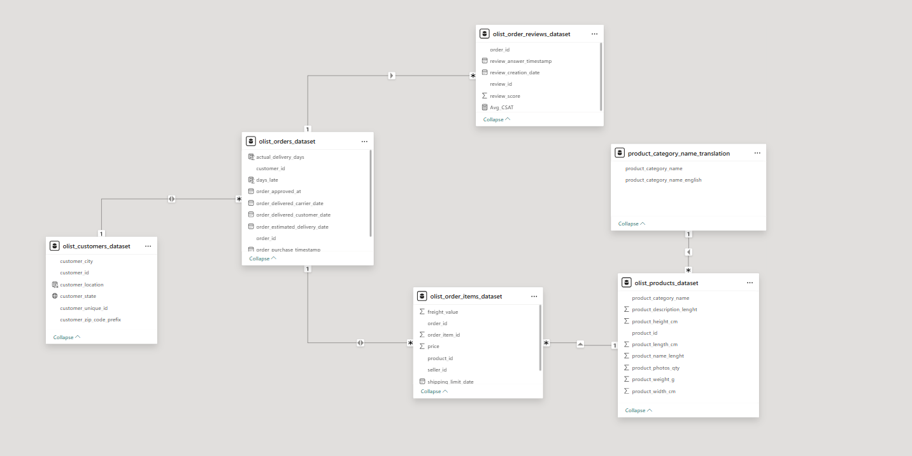
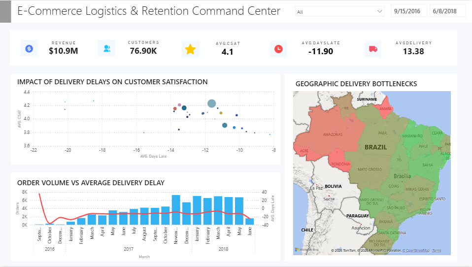

# 📦 E-Commerce Logistics & Retention Command Center
**Tech Stack:** Power BI, Power Query (ETL), DAX, Relational Data Modeling  
**Dataset:** [Olist Brazilian E-Commerce Public Dataset](https://www.kaggle.com/datasets/olistbr/brazilian-ecommerce)

## 📌 Project Objective
The objective of this project was to identify geographic freight bottlenecks and mathematically demonstrate how delivery latency affects Customer Satisfaction (CSAT) scores for a multi-million-dollar e-commerce platform.

**I will go phase by phase on how I did this project:**

## 🛠️ Phase 1: Data Extraction & Transformation (ETL)
The raw Kaggle dataset contained 9 unstructured CSV files. To optimize the Power BI engine and prevent memory bloat, I performed ETL processes using **Power Query**:
* Filtered the `Orders` table to only include `order_status = "delivered"`, removing canceled or processing orders that would skew any latency metrics.
* Converted all raw text timestamps (e.g., `order_purchase_timestamp`) into Date/Time formats for time-series analysis.

## ❄️ Phase 2: Relational Data Modeling (Snowflake Schema)
To ensure responsive cross-filtering, I used a **Snowflake Schema** to connect over 100,000 rows of relational data. 
* Designed a central Fact Table (`Orders`) surrounded by localized Dimension Tables (`Customers`, `Order Items`, `Reviews`).
* Routed the "Many-to-Many" logic between Order Items and Reviews by funneling all primary/foreign keys through the central `order_id` hub.
* Implemented a bidirectional cross-filter between `Orders` and `Order Items` so that dimensional product slicers dynamically flow upstream to recalculate revenue, geographic mapping, and CSAT scores simultaneously.



## 🧮 Phase 3: DAX Calculations & Business Logic
With the model finished, I made custom DAX calculated columns and measures to extract the core logistics KPIs:

* **Delivery Variance (Days Late/Early):**
  ```dax
  Days_Late = DATEDIFF('olist_orders_dataset'[order_estimated_delivery_date], 'olist_orders_dataset'[order_delivered_customer_date], DAY)
  ```
* **Actual Delivery Duration:**
  ```dax
  Actual_Delivery_Days = DATEDIFF('olist_orders_dataset'[order_purchase_timestamp], 'olist_orders_dataset'[order_delivered_customer_date], DAY)
  ```
* **Customer Satisfaction (CSAT):**
    ```dax
    Avg_CSAT = AVERAGE('olist_order_reviews_dataset'[review_score])
    ```
    
## 📊 Phase 4: Dashboard Design & UI/UX


👉 [Click here to view the .pbix file](https://drive.google.com/file/d/1O5GpsLst7hl6QhaD5IPEQd-yZNWOEEHh/view?usp=sharing)

I designed the frontend to act as a top-down Command Center for supply chain executives:

1.  **Scatter Plot:** Visually correlated `Days_Late` on the X-axis against `Avg_CSAT` on the Y-axis. The negative trendline instantly shows to stakeholders that poor logistics directly destroy customer retention.
2.  **Geospatial Fixes (Filled Map):** Power BI's default Bing Maps engine misidentified Brazilian state codes (e.g., reading "PR" as Puerto Rico instead of Paraná). I fixed a calculated column `(customer_state & ", Brazil")` to force geospatial boundaries, highlighting high-latency Amazonian bottlenecks in deep red via conditional formatting.
3.  **Slicers:** Incorporated a Date timeline and an English-translated Product Category dropdown to allow instant scenario testing.
